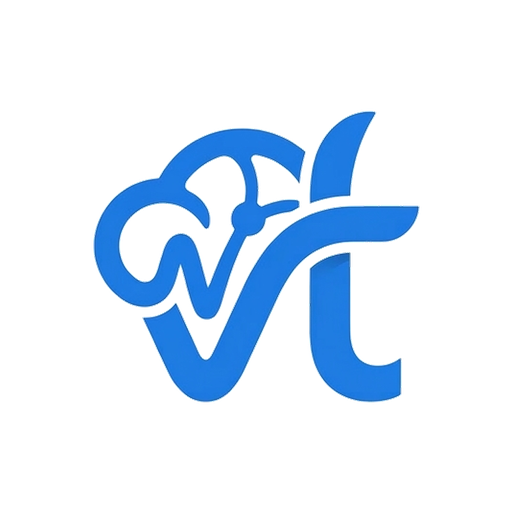
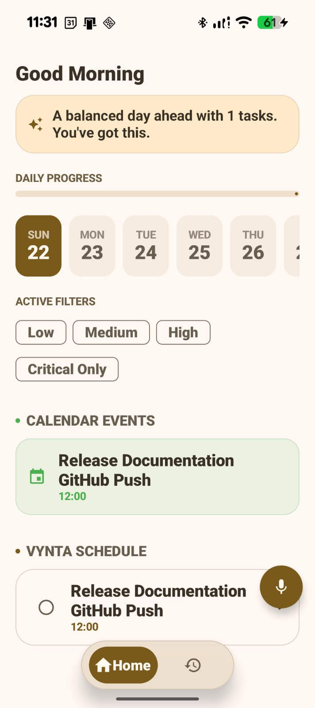
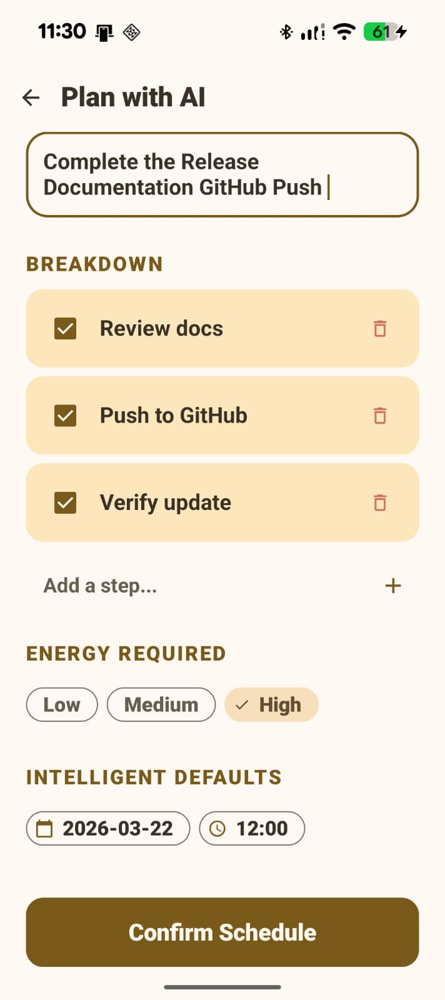
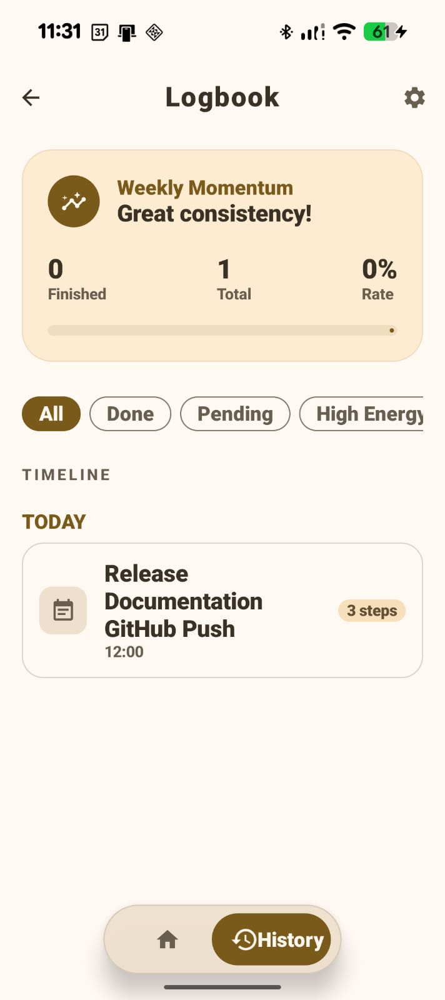
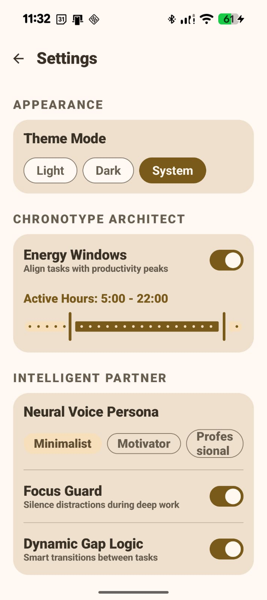

  

<h1 align="center">Vynta</h1>

  AI-powered task scheduler that actually gets how you work.

  
  
  
  

---

## What is Vynta?

Honestly, I built this because I kept missing tasks and no existing app felt smart enough to help me.

Vynta is a task scheduler that uses AI to figure out *when* you should do things — not just *what*. You describe your task in plain language, tell it your energy level, and it schedules it for you. That's basically the whole idea.

It's connected to Google Calendar, built with Jetpack Compose, and uses Groq (Llama 3) under the hood for the AI part.

Still in testing. Not perfect. But it works.

---

## Screenshots

| Home | Create Task | History | Settings |
| :---: | :---: | :---: | :---: |
|  |  |  |  |

---

## Features

- **Natural language input** — just describe what you need to do, AI handles the rest
- **Energy-aware scheduling** — low, medium, or high energy tasks get scheduled at the right time
- **Google Calendar sync** — works with whatever you're already using
- **History + productivity tracking** — see how consistent you actually are
- **Dark mode first** — because that's just how it should be
- **Material 3** — follows Android's design guidelines properly

---

## Tech Stack

| What | How |
| :--- | :--- |
| UI | Jetpack Compose + Material 3 |
| AI | Groq API (Llama 3) via Retrofit |
| Database | Room + DataStore |
| Background work | Kotlin Coroutines & Flow |
| Architecture | MVVM |
| Calendar | Google Calendar API |

---

## What's Next

Things I'm still working on:

- [ ] Home screen widgets
- [ ] Better onboarding flow
- [ ] Smarter AI suggestions based on past patterns
- [ ] Streak system for habits
- [ ] UI polish (the settings screen needs work)

---

## License

This is a proprietary project. Not open source. All rights reserved.

You can look at it for reference or review — just don't redistribute or use the code commercially without asking me first.

---

## Built by

**Murshid R**
3rd year CS student @ Dr. M.G.R Educational and Research Institute, Chennai
AI Research Engineer @ ACS Space Technology Centre

This is one of my personal projects I actually use day to day.

[LinkedIn](https://linkedin.com/in/murshid-r-37088b272) · [GitHub](https://github.com/AA1-31-Murshid) · [Portfolio](https://murshid-r.vercel.app)

---

  <i>© 2026 Murshid R. Built in Chennai.</i>

